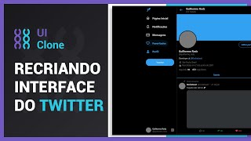
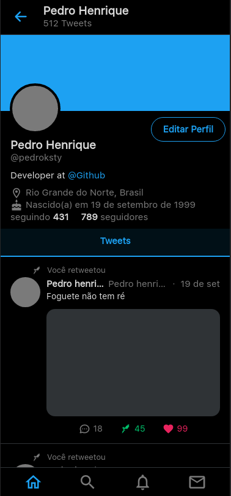
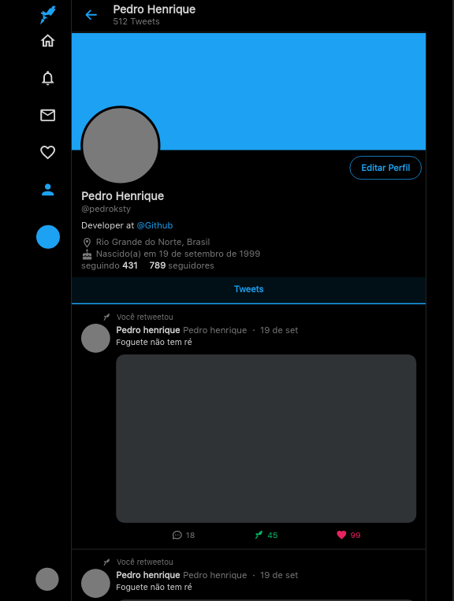
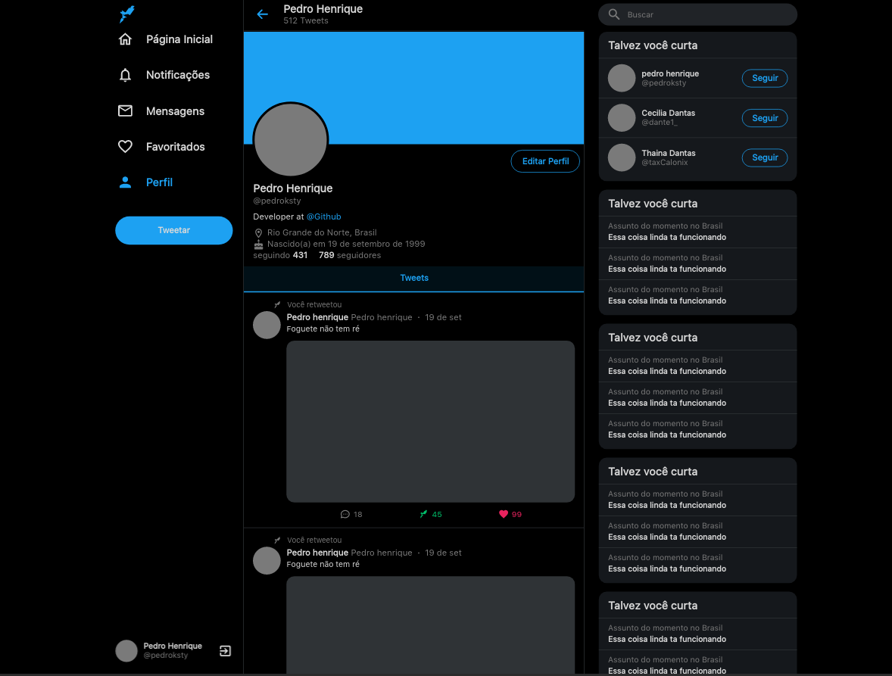

<h1 align="center">
    
</h1>

<p align="center">
  

  

  	
  <a href="https://www.twitter.com/pedroksty/">
    
  </a>
	
  
  <a href="https://github.com/pedroksty/twitter-clone-ui/commits/master">
    
  </a>

  
   <a href="https://github.com/pedroksty/twitter-clone-ui/stargazers">
    
  </a>
</p>


## 💻 Sobre o projeto

Aplicação em React com TypeScript e styled components com objetivo de clonar a interface do twitter.

## 🎨 Layout

### 📱 Mobile

<p align="center">
  

</p>

### 🧭 Tablet

<p align="center" style="display: flex; align-items: flex-start; justify-content: center;">

  
</p>

### 🧭 Web

<p align="center" style="display: flex; align-items: flex-start; justify-content: center;">

  
</p>

## 🛠 Tecnologias

As seguintes ferramentas foram usadas na construção do projeto:

- [React][reactjs]
- [TypeScript][typescript]
- [Styled Components][styled-components]

## 🚀 Como executar o projeto

### Pré-requisitos

Antes de começar, você vai precisar ter instalado em sua máquina as seguintes ferramentas:
[Git](https://git-scm.com), [Node.js][nodejs], [Yarn][Yarn]. 
Além disto é bom ter um editor para trabalhar com o código como [VSCode][vscode]


### 🧭 Rodando a aplicação 

```bash
# Clone este repositório
$ git clone https://github.com/pedroksty/twitter-clone-ui.git

# Acesse a pasta do projeto no seu terminal/cmd
$ cd twitter-clone-ui

# Instale as dependências
$ yarn

# Execute a aplicação em modo de desenvolvimento
$ yarn start

# A aplicação será aberta na porta:3000 - acesse http://localhost:3000
```

## 😯 Como contribuir para o projeto

1. Faça um **fork** do projeto.
2. Crie uma nova branch com as suas alterações: `git checkout -b my-feature`
3. Salve as alterações e crie uma mensagem de commit contando o que você fez: `git commit -m "feature: My new feature"`
4. Envie as suas alterações: `git push origin my-feature`
> Caso tenha alguma dúvida confira este [guia de como contribuir no GitHub](https://github.com/firstcontributions/first-contributions)


## 📝 Licença

Este projeto esta sobe a licença MIT.

Feito com ❤️ por Pedro henrique 👋🏽 [Entre em contato!](https://www.linkedin.com/in/pedro-henrique-b9541a199/)

[nodejs]: https://nodejs.org/
[typescript]: https://www.typescriptlang.org/
[expo]: https://expo.io/
[reactjs]: https://reactjs.org
[rn]: https://facebook.github.io/react-native/
[yarn]: https://yarnpkg.com/
[vscode]: https://code.visualstudio.com/
[vceditconfig]: https://marketplace.visualstudio.com/items?itemName=EditorConfig.EditorConfig
[license]: https://opensource.org/licenses/MIT
[vceslint]: https://marketplace.visualstudio.com/items?itemName=dbaeumer.vscode-eslint
[prettier]: https://marketplace.visualstudio.com/items?itemName=esbenp.prettier-vscode
[rs]: https://rocketseat.com.br
[yarn]: https://yarnpkg.com/getting-started/install
[styled-components]: https://styled-components.com/